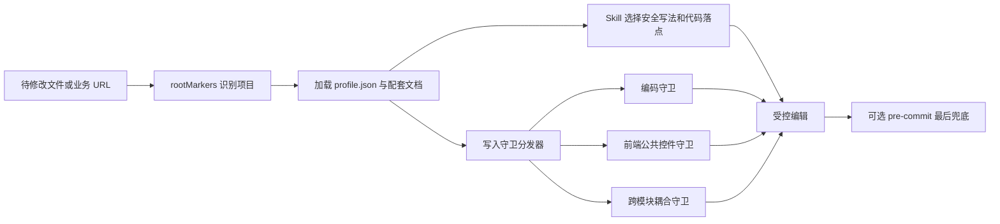

# project-coding-profiles

项目级编码画像插件。它让 Claude Code、Codex 和 Cursor 在写入源码前识别“当前是什么项目”，再加载该项目真实的编码、框架、公共能力、脚手架和路由规则。

> `team-standards` 规定团队共性，`project-coding-profiles` 保存项目差异。本仓库不保存业务真理，也不把某个遗留项目的特殊约束写进团队通用规范。

## 快速导航

- [解决的问题](#解决的问题)
- [能力架构](#能力架构)
- [当前能力](#当前能力)
- [Yoooni 画像亮点](#yoooni-画像亮点)
- [安装与使用](#安装与使用)
- [登记新项目](#登记新项目)
- [维护与验证](#维护与验证)

---

## 解决的问题

遗留项目的正确写法通常不是一套全局规则：编码可能是 GBK/UTF-8 混合，框架可能是 Struts2+iBATIS，公共组件、菜单接线和页面路由也各不相同。只靠模型记忆会导致乱码、重复造轮子、跨模块耦合和错误落点。

本插件把这些差异收敛为可版本化的 `profile.json` 与配套文档，并在写盘前由 Hook 机械校验。

| 负责 | 不负责 |
|---|---|
| 项目识别和编码真值 | 团队通用设计与编码规范 |
| 项目特有的层次、命名和接线方式 | 业务字段和状态的真实语义 |
| URL 到模块/Action/JSP 的定位 | 跨项目接口调用拓扑 |
| 新模块纵向切片脚手架 | 工具链安装和自动更新 |

---

## 能力架构



架构亮点：

- **零侵入识别**：使用项目已有的唯一文件作为 `rootMarkers`，不要求修改业务仓库。
- **画像即单一事实源**：编码真值、项目规则和脚手架都从 profile 读取，不在 Skill 里复制。
- **Skill + Hook 双层保护**：Skill 处理语义和操作顺序，Hook 处理可以机械判断的写盘红线。
- **多工具投递**：Claude Code/Codex 使用插件 Hook 与 Skill，Cursor 使用规则文件和 Git pre-commit 兜底。

---

## 当前能力

| 能力 | 入口 | 说明 |
|---|---|---|
| 编码保护 | `encoding-guard` | 探测文件编码；GBK 文件按 UTF-8 编辑后转回原编码并复核 |
| 项目写法 | `codingMode` | 声明层次、命名、技术栈、接线位置、公共能力和只读红线 |
| 前端公共控件 | `frontendControls` | 阻止原生 `alert/confirm/prompt`，引导复用项目公共控件 |
| 跨模块耦合 | `crossModuleCoupling` | 发现页面直接引用其他业务模块私有资源时提示风险 |
| 模块脚手架 | `module-scaffold` | 按已确认范本生成后端、前端、配置和菜单纵向切片 |
| URL 定位 | `url-locate` | 从 URL 或 `*.action` 直达后端 Action、Spring Bean 和 JSP |

三个 Skill 位于 [`plugins/project-coding-profiles/skills/`](plugins/project-coding-profiles/skills/)：

- [`encoding-guard`](plugins/project-coding-profiles/skills/encoding-guard/SKILL.md)
- [`module-scaffold`](plugins/project-coding-profiles/skills/module-scaffold/SKILL.md)
- [`url-locate`](plugins/project-coding-profiles/skills/url-locate/SKILL.md)

---

## Yoooni 画像亮点

当前首个完整画像是 Yoooni 纺织面料 ERP：Spring + Struts2 + DWR + iBATIS，JDK 1.8 / Resin4。

### 混合编码真值

- `src/**` 默认 GBK，`WebRoot/**` 默认 UTF-8。
- `src/**/model/maps/*.xml` 按 UTF-8 处理。
- [`encoding-map.json`](plugins/project-coding-profiles/profiles/yoooni/encoding-map.json) 保存逐路径权威编码，优先级高于通用 glob 和启发式探测。
- 只转换本次触及文件，禁止为了“统一”批量转码。

### 遗留架构导航

- [`coding-mode.md`](plugins/project-coding-profiles/profiles/yoooni/coding-mode.md) 定义 Action、Manage、Dao、iBATIS、Spring、Struts 和页面接线方式。
- [`common-capabilities.md`](plugins/project-coding-profiles/profiles/yoooni/common-capabilities.md) 要求优先复用公共能力。
- [`url-route-map.md`](plugins/project-coding-profiles/profiles/yoooni/url-route-map.md) 由 Struts/Spring 配置生成，用于 URL 直达代码。
- [`scaffold/new-module.md`](plugins/project-coding-profiles/profiles/yoooni/scaffold/new-module.md) 以成熟模块为范本生成完整纵向切片。

---

## 安装与使用

推荐通过 `yoooni-daily-plugin` 一键安装整套工具。单独安装时，在 Claude Code 中执行：

```text
/plugin marketplace add https://gitee.com/wyoooni/project-coding-profiles.git
/plugin install project-coding-profiles@project-coding-profiles
/reload-plugins
```

安装后，直接给出文件、模块需求或页面 URL 即可。例如：

```text
这个项目有 GBK 文件，先探测编码再修改。
按项目最佳实践新增一个成本模块。
定位 /erp/example_list.action 对应的 Action 和 JSP。
```

在源码仓库中手工执行编码检查：

```powershell
$guard = "plugins/project-coding-profiles/skills/encoding-guard/detect-encoding.ps1"

# 探测
powershell -ExecutionPolicy Bypass -File $guard -Action detect -Path "D:\project\src\Foo.java"

# GBK 安全回环
powershell -ExecutionPolicy Bypass -File $guard -Action convert -Path "D:\project\src\Foo.java" -From gbk -To utf-8
# 编辑文件
powershell -ExecutionPolicy Bypass -File $guard -Action convert -Path "D:\project\src\Foo.java" -From utf-8 -To gbk
powershell -ExecutionPolicy Bypass -File $guard -Action detect -Path "D:\project\src\Foo.java"
```

Cursor 没有插件写盘前 Hook，可在目标项目安装 Git 兜底：

```powershell
powershell -ExecutionPolicy Bypass -File plugins/project-coding-profiles/hooks/install-git-hooks.ps1 -ProjectRoot "D:\project" -Mode block
```

---

## 登记新项目

在 `plugins/project-coding-profiles/profiles/<project>/` 建立画像，最小结构如下：

```json
{
  "name": "example",
  "displayName": "Example System",
  "rootMarkers": ["path/to/unique-marker"],
  "encoding": {
    "default": "utf-8",
    "rules": [
      { "glob": "legacy/**", "encoding": "gbk" },
      { "glob": "web/**", "encoding": "utf-8" }
    ]
  },
  "codingMode": {
    "doc": "coding-mode.md",
    "commonCapabilities": "common-capabilities.md"
  }
}
```

登记原则：

1. `rootMarkers` 必须足够唯一，避免在错误项目触发。
2. 编码优先使用可审查的权威映射，启发式探测只作参考。
3. 团队共性不要复制进 profile，应继续引用 `team-standards`。
4. 脚手架必须来自项目中已经验证过的成熟范本。
5. 路由映射应由配置或代码生成，避免人工维护大表。

---

## 维护与验证

```text
project-coding-profiles/
├── .agents/                                  # Codex marketplace
├── .claude-plugin/                           # Claude marketplace
├── plugins/project-coding-profiles/
│   ├── .claude-plugin/                       # Claude 插件 manifest
│   ├── .codex-plugin/                        # Codex 插件 manifest
│   ├── profiles/                             # 每项目一份画像
│   ├── skills/                               # encoding/scaffold/url-locate
│   └── hooks/                                # 三条并发写入守卫与 Git 兜底
├── docs/                                     # 设计与测试说明
├── AGENTS.md / CLAUDE.md
└── README.md
```

```bash
# Hook 测试
cd plugins/project-coding-profiles/hooks && npm test
```

Hook 默认行为可分别通过 `PCP_ENCODING_HOOK`、`PCP_FRONTEND_HOOK`、`PCP_CROSSMODULE_HOOK` 调整；值为 `block`、`warn` 或 `off`。`PCP_HOOK_METRICS=on` 只记录本地匿名耗时，不记录 Prompt、文件内容或绝对路径。

仅修改仓库 README 不需要重新安装插件；画像、Skill、Hook 或 manifest 变化后才需要递增版本并重新加载。
